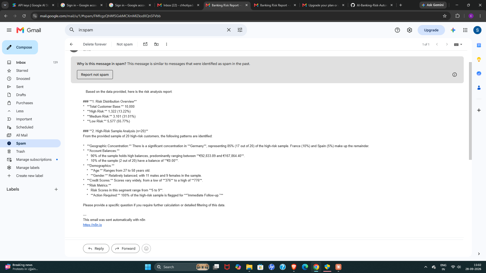
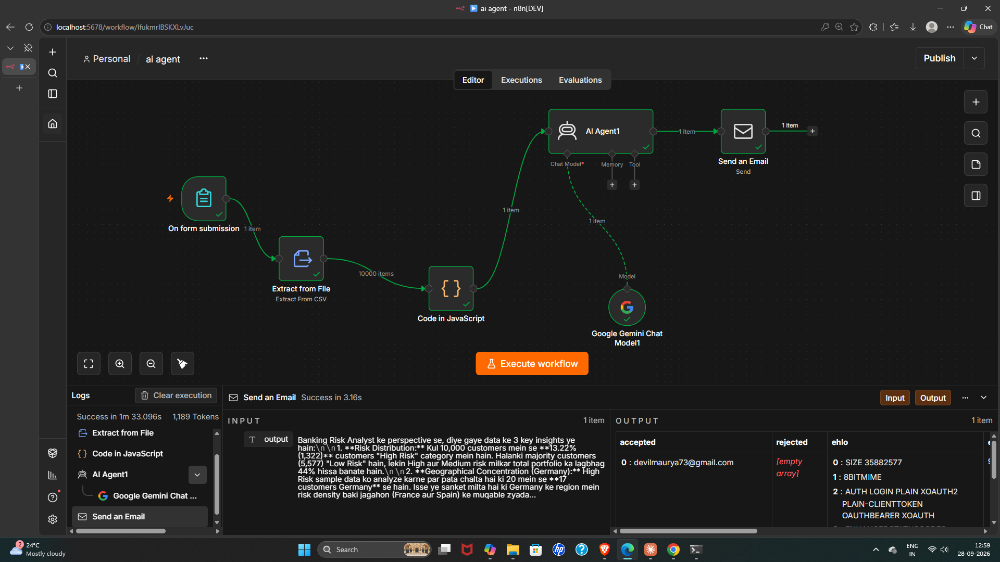

# AI Banking Risk Automation

An end-to-end customer risk pipeline for a bank: raw data is cleaned with **Python (pandas)** and **PostgreSQL**, scored with rule-based risk logic, and then handed to **n8n** workflows that split customers by risk level and generate an **AI-written risk report (Google Gemini)** delivered by email.

---

## Pipeline

```text
Banking Dataset
      ↓
Python + pandas        → cleaning, feature checks
      ↓
PostgreSQL             → SQL analysis, risk rules
      ↓
Risk Score + Level     → High / Medium / Low, with an action for each
      ↓
n8n Workflow 1         → split by risk level, export 3 CSV reports
      ↓
n8n Workflow 2         → AI risk analyst (Gemini) → email report
```

---

## Dataset

Source: bank customer churn dataset (`data/Churn_Modelling.csv`, 10,000 customers). The identifier columns `RowNumber`, `CustomerId` and `Surname` were dropped during cleaning.

Final file: `final_customer_risk_report.csv` (10,000 customers, 11 columns)

| Column         | Description                               |
| -------------- | ----------------------------------------- |
| Geography      | Customer country (France, Germany, Spain) |
| Gender         | Male / Female                             |
| Age            | Customer age                              |
| CreditScore    | Credit score (350 to 850)                 |
| Balance        | Account balance                           |
| NumOfProducts  | Number of bank products held              |
| IsActiveMember | 1 if active, 0 if not                     |
| RiskScore      | Rule-based score (0 to 9)                 |
| RiskLevel      | High Risk / Medium Risk / Low Risk        |
| Action         | Recommended action for the customer       |
| Exited         | 1 if the customer left the bank           |

## Risk levels and actions

| RiskScore | RiskLevel   | Action              | Customers |
| --------- | ----------- | ------------------- | --------- |
| 0 to 2    | Low Risk    | Normal Monitoring   | 5,577     |
| 3 to 4    | Medium Risk | Contact Customer    | 3,101     |
| 5 to 9    | High Risk   | Immediate Follow-up | 1,322     |

### How RiskScore is calculated

Each customer starts at 0 and earns points for churn-linked warning signs. These rules come from the churn analysis in `analysis.py` (the same logic is used in the SQL analysis):

| Condition                                   | Points |
| ------------------------------------------- | ------ |
| Geography is Germany                        | +2     |
| Not an active member (`IsActiveMember = 0`) | +2     |
| Holds 3 or more products                    | +3     |
| Age 45 or above                             | +1     |
| Balance 90,000 or above                     | +1     |

The maximum score is 9. A score of 5 or more is **High Risk**, 3 to 4 is **Medium Risk**, and below 3 is **Low Risk**.

## Key findings

* **13.2%** of customers are High Risk, **31.0%** Medium, **55.8%** Low.
* The risk levels track real churn: **50.6%** of High Risk customers exited, against **26.5%** for Medium and **9.8%** for Low. The overall churn rate is 20.4%.
* **Germany** holds 1,193 of the 1,322 High Risk customers (about 90%), even though it is not the largest market. France and Spain have very few.

---

## n8n workflows

### Workflow 1: Risk report automation

`Form Trigger (CSV upload) → Extract from File → Switch (RiskLevel) → Convert to File ×3`

The uploaded CSV is split by `RiskLevel`, and one downloadable CSV is produced for each of High, Medium and Low Risk customers.

### Workflow 2: AI risk analyst

`Form Trigger (CSV + question) → Extract from File → Code → AI Agent (Gemini) → Send Email (SMTP)`

1. The user uploads the risk CSV and types a question, for example "Give me an executive summary" or "What action should we take for High Risk customers?"
2. A Code node condenses the data into totals per risk level plus a sample of High Risk customers, so the prompt stays within model limits.
3. The AI Agent (Google Gemini) answers as a banking risk analyst using only that data.
4. The answer is emailed automatically via Gmail SMTP.

Workflow exports are in the `n8n/` folder and can be imported through **Workflow → Import from File**.

---

## 📸 Screenshots

### 📧 email-report.png



### 🤖 workflow2-ai-analyst.png



---

## Tech stack

* **Python** (pandas) for data cleaning
* **PostgreSQL** for SQL analysis and risk rules
* **n8n** (self-hosted) for workflow automation
* **Google Gemini** for the AI risk analyst
* **Gmail SMTP** for email delivery

## Repository structure

```text
AI-Banking-Risk-Automation/
├── data/
│   └── Churn_Modelling.csv             # raw dataset
├── analysis.py                         # pandas cleaning, churn analysis, risk scoring
├── banking_risk_analysis.sql           # PostgreSQL analysis queries
├── customer_risk_report.csv            # full dataset with risk columns
├── final_customer_risk_report.csv      # final report used by n8n
├── n8n/
│   ├── risk-report-workflow.json
│   └── ai-risk-analyst-workflow.json
├── screenshots/
│   ├── email-report.png
│   └── workflow2-ai-analyst.png
└── README.md
```

## How to run the n8n part

1. Install and start n8n (`npm install n8n -g`, then `n8n start`).
2. Import both workflow JSON files.
3. Add your own credentials: a Google Gemini API key and SMTP details (Gmail app password).
4. Click **Execute workflow**, upload `final_customer_risk_report.csv` in the form, and submit.

> Credentials are not included in the exported workflows. Never commit API keys or app passwords to the repository.

## Future improvements

* Run automatically on a schedule instead of a manual form upload
* Send High Risk alerts to Slack or a CRM
* Pass the full dataset to the AI through a database or vector store, so it can answer customer-level questions
* Build a Power BI dashboard on top of the risk report
